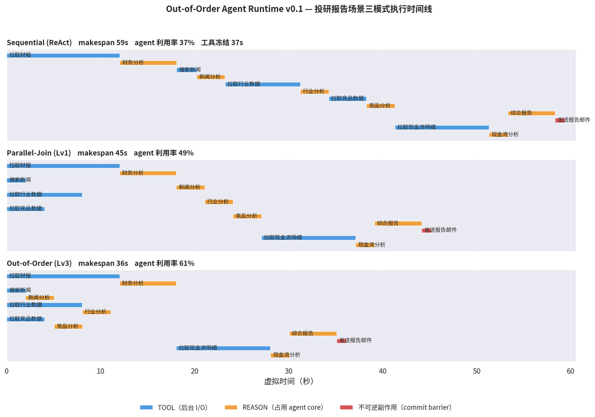

# OOO Agent Runtime

> Dependency-aware 的实验性 Out-of-Order Agent Runtime。副作用隔离与持久恢复尚未完成。
>
> 核心命题：传统 Agent 是一条同步阻塞的思维链（`LLM → tool → WAIT → LLM`）；
> 本 runtime 把 Agent 改成**事件驱动的任务调度器**——慢工具 pending 期间，
> agent core 继续消费 READY 任务，结果以事件形式回来后唤醒依赖节点。

**场景观测（历史真实模型对照，非通用性能保证）**：OOO 的收益不只来自同批并行，还来自**提前决策、提前派发后继工作**——
慢工具 + 发现式慢 follow-up 地形下快 27.5%（1.38×）；工作可折叠进一次调用的
地形下反而慢 28%（调用开销经济学）。详见[技术报告](docs/OOO-Agent-Runtime-技术报告.md)。

## 仓库结构

```
├── ooo_runtime/  examples/  benchmarks/   # Python v0.1 原型（三分钟看懂想法）
├── docs/                                  # 设计总览（单一权威入口）+ 设计文档
                                           # + 技术报告 + 评审/竞品文档 + 甘特图
└── dsh-plugin/                            # dsh 插件包快照（ooo-loop + ooo-mock-lab）
                                           # 及宿主集成 patch、复现步骤
```

**读这份就够了**：[docs/OOO-Agent-Runtime-设计总览.md](docs/OOO-Agent-Runtime-设计总览.md)——
问题、核心设计、两条实现线、实验结论、外部定位、已知缺陷、路线图，一份文档串完。

两条实现线：Python 原型验证想法（三模式对照 59s/45s/36s）；
dsh 插件线把它做成真实框架里的可替换 agent loop（fork agent-loop + profile patch
切换），并用"mock 实验室 + 真实模型（Kimi K2）"完成了四层实验验证。

---

# 以下为 Python v0.1 原型文档

## 调研定位（2026-09 现状）

| 层级 | 能力 | 代表工作 | 成熟度 |
|---|---|---|---|
| L0 | Sequential ReAct | 经典 ReAct loop | 基线 |
| L1 | Parallel Tool Calling（同批并发 + join） | OpenAI Agents SDK、LangGraph superstep | 成熟 |
| L2 | 非阻塞 Agent（工具 pending 时继续工作） | Google ADK non-blocking tool、AutoGen Core | 产品化中 |
| L3 | 动态 DAG + 乱序调度 + 推测执行 | LLMCompiler (ICML'24, 3.7×)、PASTE (2026, -48.5%)、Speculative Actions (ICLR'26)、AOSPEC (2026) | 论文/原型 |

**缺口**：尚无被广泛采用的通用运行时，把动态依赖发现、有状态乱序执行、
副作用隔离、验证提交、取消与 durable recovery 统一起来。本仓库是这个方向的
可运行最小骨架：先覆盖「动态 DAG + 事件驱动乱序调度 + 提交屏障」，
推测执行与 durable recovery 留作 roadmap。

DSH 插件已补充失败/取消停止派发、工具独占与并发限制、严格模型参数/结束状态、首轮 inbox 收敛及专门回归测试。当前依然是首轮配置 DAG 实验，不具备完整请求历史或安全事务提交，详见[插件说明](dsh-plugin/packages/ooo-loop/README.zh.md)。

## CPU 类比映射

| CPU | 本 runtime |
|---|---|
| instruction | `Task` |
| register dependency | `depends_on` |
| reservation station / ready queue | `TaskGraph.ready()` 扫描 |
| cache miss | 慢 `TOOL` 任务 |
| 单核流水线 | `REASON` 任务共享的 agent core（Semaphore(1)） |
| 动态依赖发现 | `Task.spawn`：任务完成后向图中注入新任务 |
| reorder buffer / retirement | commit barrier：`IRREVERSIBLE` 任务只在依赖全部 DONE 后提交副作用 |

关键原则（来自调研）：**可以乱序执行，但必须按安全约束提交。**

## 快速开始

```bash
# 场景 DAG 概览
python examples/investment_report.py

# 三模式对照 benchmark（约 8 秒，虚拟时间 5% 速率回放）
python benchmarks/compare.py

# 渲染时间线对比图（需要 daimon managed python）
python benchmarks/gantt.py
```

## Benchmark 结果（投研报告场景）

场景：拉取财报(12s)/新闻(2s)/行业(8s)/竞品(4s) → 各自分析 → 综合报告(5s) → 发送邮件（不可逆）。
其中「拉取现金流明细(10s) + 现金流分析(2s)」在**运行时才被财务分析动态发现**。

| 模式 | makespan | 加速比 | agent 利用率 | 工具冻结 |
|---|---|---|---|---|
| Sequential (ReAct) | 59s | 1.00× | 37% | 37s |
| Parallel-Join (L1) | 45s | 1.31× | 49% | 23s |
| **Out-of-Order (L3)** | **36s** | **1.64×** | **61%** | 0s |



Out-of-Order 相对 Parallel-Join 的两个增益来源，图上都清晰可见：

1. **流式消费**：新闻(2s)一回来，新闻分析立刻开始，不等最慢的财报(12s)；
   join 屏障下所有分析都要等到 12s。
2. **动态发现即调度**：财务分析 18s 完成时 spawn 的「拉取现金流明细」立刻派发；
   wave 语义下它要等下一轮 replan（27s 才启动）。

## 代码结构

```
ooo-runtime/
├── ooo_runtime/
│   └── core.py            # Task / TaskGraph / Runtime（三种调度模式）/ commit barrier
├── examples/
│   └── investment_report.py   # 投研报告场景（含 spawn 动态发现、不可逆副作用）
└── benchmarks/
    ├── compare.py         # 三模式对照 + 指标输出
    ├── gantt.py           # 时间线渲染
    ├── results.json       # 执行轨迹
    └── gantt.png
```

## v0.1 已实现 / 未实现

已实现：

- [x] 动态任务图 + READY 扫描调度
- [x] REASON/TOOL 双类资源模型（agent core 单线程，工具后台并发）
- [x] 运行时动态依赖发现（`spawn`）
- [x] `effect_class` 元数据 + 不可逆操作的依赖就绪门禁（不保证全局按序提交）
- [x] 三模式对照 benchmark：makespan / 利用率 / 工具冻结时间 / 执行轨迹

Roadmap（对应调研中的缺口）：

- [ ] 推测执行：对高可预测后继任务提前派发，验证后 commit / mispredict 后丢弃
- [ ] read_set / write_set 冲突检测（并发副作用安全）
- [ ] 取消与 pipeline flush（取消传播、部分结果作废）
- [ ] 真实 LLM 接入：planner 从自然语言生成 DAG，替代手写场景
- [ ] cost-aware 调度：推测预算 vs 关键路径收益的权衡
- [ ] durable recovery：事件日志 + 状态快照，崩溃后从断点恢复（Temporal 思路）

## 指标定义

- **makespan**：首个任务开始到最后一个任务完成的 wall-clock（虚拟秒）
- **agent 利用率** = REASON 任务总时长 / makespan（agent core 没闲着的时间占比）
- **工具冻结**：顺序/join 模式下 agent 因等工具而无法推理的时间

调研判断：目标不应是「agent 永不空闲」（那会把 I/O 等待换成 token 成本与幻觉风险），
而是**关键路径缩短 / 增加的推理与推测成本**。v0.1 先测前半项。
