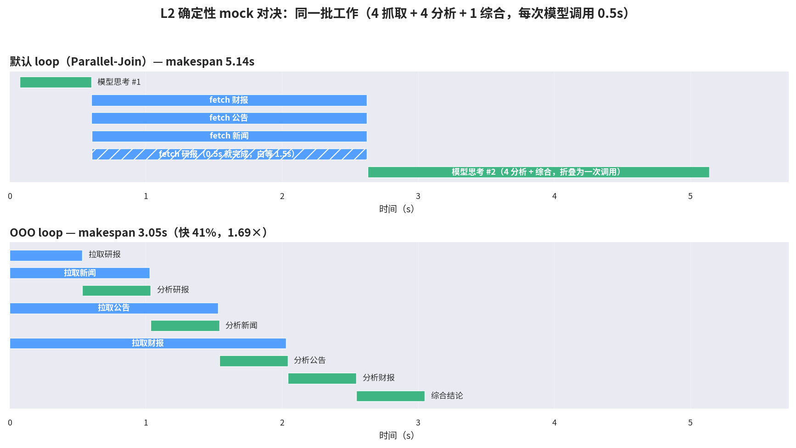
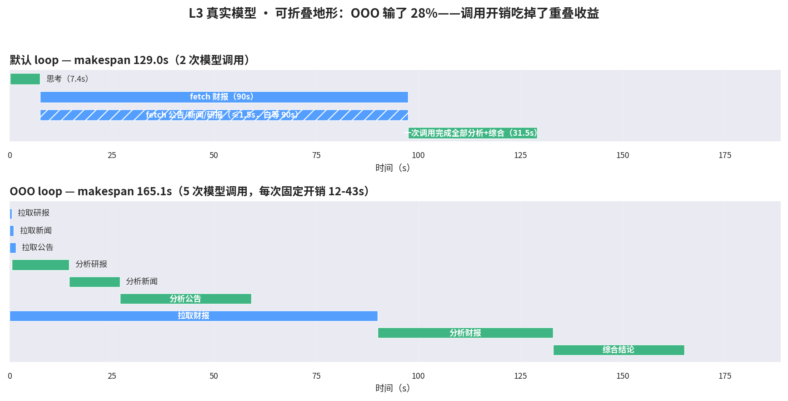
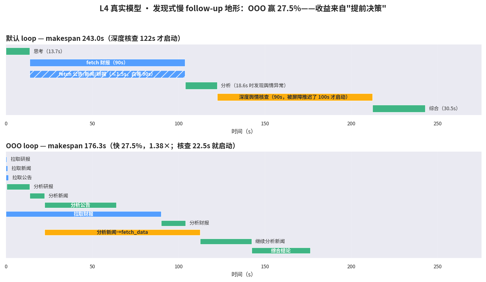

# 让 Agent 学会"乱序执行"：从 30 行原型到真实模型对决的完整记录

> 一句话总结：我们把 CPU 乱序执行（Out-of-Order Execution）的思想搬进了 Agent runtime，在 DeepSeek Harness 上做出了一版可运行的 OOO Loop，并用"mock 实验室 + 真实模型"四层实验验证了它——结论不是"OOO 更快"，而是一句更有用的话：**OOO 的收益不来自并行，来自提前决策**。

## 1. 问题：Agent 的时间都浪费在哪了

先从一个具体场景说起。让 Agent 写一份投研简报，需要四路数据：财报（慢，假设要 90 秒）、公告、新闻、研报（都快，1 秒内）。

现在所有主流 Agent 框架的执行模型都是这样的循环：

```
思考 → 发起工具调用 → 等所有工具返回 → 再思考 → 再调工具 → ……
```

工具并发本身早就解决了——模型可以在一次响应里发起多个调用，runtime 并发执行。但有一个东西没解决：**join 屏障**。runtime 会把模型这一步发出的所有工具调用捆在一起，最快的 0.5 秒就完成，也必须等最慢的 90 秒，结果才能一起"提交"给模型。模型在这 90 秒里完全空转。

这还不是最糟的。更糟的是**决策也被推迟了**：假设新闻数据 1 秒就回来了，里面写着"有负面报道需要核查"——核查又是个 90 秒的慢操作。但在 join 屏障下，模型要到 90 秒后才能看到这条新闻、才能做出"去核查"的决策。一个本可在第 15 秒就启动的慢任务，被推迟到第 120 秒。

如果你学过 CPU 体系结构，这个味道非常熟悉——这就是**顺序执行 vs 乱序执行**的问题。

## 2. 类比：把 CPU 的解法搬过来

CPU 在 1960 年代也面临一模一样的问题：指令顺序执行，一条乘法要等上一条内存读取（慢操作）完成。解法就是乱序执行：依赖就绪的指令先跑，不等前面的慢指令。

| CPU 概念 | Agent 对应物 |
|---|---|
| 指令 | 一个任务节点（一次模型推理 / 一次工具调用） |
| 寄存器依赖 | 节点间的数据依赖（B 需要 A 的结果） |
| 保留站（Reservation Station） | READY 队列：依赖全满足的节点集合 |
| cache miss（慢内存） | 慢工具调用（爬网页、查数据库、等审批） |
| 单核发射 | 模型一次只能处理一个请求（单 agent core） |
| 退休（Retire）按序 | 有副作用的操作必须按依赖序提交（commit gate） |

核心不变量只有一条：**只要"核心"（模型）有就绪的推理任务，就绝不让它空转**；工具调用扔到后台并发跑，结果一回来就唤醒依赖它的推理节点。

## 3. 第一步：30 分钟原型，先证明想法值不值得做

动手改任何框架之前，我们先用 Python 写了个 200 行的玩具 runtime（`ooo-runtime/ooo_runtime/core.py`）：节点分 REASON（占模型核心，串行）和 TOOL（后台并发）两类，`TaskGraph` 管依赖，调度器事件驱动地扫 READY 队列。

同一个投研场景，三种执行策略：

| 策略 | 耗时 | 模型核心利用率 |
|---|---|---|
| 顺序执行（一个抓取一个分析） | 59s | 37% |
| Parallel-Join（现在的 Agent 框架） | 45s | 49% |
| **OOO** | **36s** | **61%** |

想法成立，值得动真格。但玩具原型证明不了它能活在真实框架里——会话持久化、取消语义、工具权限、UI 渲染全都是坑。所以下一步是找一个真实的宿主。

## 4. 第二步：为什么是 dsh 插件，而不是自己造框架

选了 DeepSeek Harness（dsh）做宿主，原因很实际：它的 agent loop **本身就是一个可替换的插件**。关键架构事实（都是读源码核实过的）：

- 默认 loop 是 `ReactLoopAgent`，由 `core/agent-loop` 包注册为全局 agent factory
- factory 全局唯一（重复注册直接抛错）——所以新旧 loop **不能共存，只能整体替换**
- dsh 有 profile patch 机制（`--patch xxx.yml`）：可以在配置层禁用一行插件、插入另一行，**不改宿主一行代码**就能换掉 agent loop

这决定了实现路径：**fork `agent-loop` 包，在里面加一条 OOO 执行路径，用 patch 文件做 A/B 切换**。好处是生命周期管理、会话落账、工具管线全部继承久经测试的实现，我们只动调度逻辑。

## 5. 实现路径：三步走到真实模型

### M1：把调度器插进驱动（静态 DAG）

**调度器移植**（`ooo-loop/src/scheduler.ts`，230 行）：Python 原型直接翻成 TypeScript。主循环是不变式驱动的：扫描就绪节点 → REASON 进单槽串行队列、TOOL 直接并发派发 → 等待任意一个完成事件 → 重新扫描。

**驱动挂钩**：fork 的 `ReactLoopAgent.turn()` 开头加了一个分支——如果插件配置里声明了静态 DAG，第一轮就不走对话循环，改走 `runOutOfOrder()`。两类节点分别接真实管线：

- TOOL 节点走 dsh 工具运行时标准管线（prepare → dispatch → finalize），和默认 loop 执行工具调用是同一条路，权限、审计、错误处理全保留
- REASON 节点是一次独立模型请求，提示词自动注入**祖先锥**（它的全部传递依赖）的结果

**一个有意思的设计修正**：原本计划往会话日志写自定义 `ooo/*` 事件做观测，读源码发现 `Session.append()` 根本不接受 `ignorable` 标记——自定义事件落账后，任何不认识它的 reader 都会拒绝重建会话，这个会话就永久不可恢复了。所以 OOO 的观测数据改走 side-channel JSON trace 文件，会话日志只留标准的 `turn/start`/`turn/end` 边界。**在别人的框架里做实验，先搞清楚什么不能碰，比搞清楚什么能碰更重要。**

### M2：模型在运行中扩展任务图（spawn）

静态 DAG 只是起点——真正的 OOO 应该让模型在运行中发现新工作。机制设计得很自然：**REASON 节点的模型响应里带 tool-call，就是 spawn 指令**。模型不需要学任何新 API，普通 function call 就是动态发现的载体。

运行时收到这样的响应后做三件事：

1. 当前节点以"初步结论"完成
2. 每个 tool call 展开成一个 TOOL 节点 + 一个续跑 REASON 节点（依赖新工具结果，提示词自动带上父节点的初步结论和祖先锥上下文）
3. **依赖改道**：原本依赖这个节点的下游，全部改挂到续跑节点上——否则"综合结论"会在竞争对手数据还没回来时就拿着初步结论开跑。这是 spawn 语义的核心正确性点，实现在 `TaskGraph.rerouteDependents()`，十行代码。

### L3：接入真实模型（Kimi K2）

没有 DeepSeek API key，但发现本机的 Kimi-for-coding key 走 `agent-gw.kimi.com/coding`（Anthropic 协议），而 dsh 的 deepseek 适配器支持环境变量重定向——**零代码改动接入真实模型**。工具保持确定性（固定延迟 + 拟真罐头数据），这样"模型真实、环境确定"，调度行为可复现。

真实模型第一跑就照出两个 mock 永远照不出来的 bug：

1. **静默失败**：dsh 的适配器错误是通过流的 `finish` chunk 上抛的，不是异常。我们的消费端只收集文本块，把认证失败吞成了"空分析"——节点全部显示"成功"，2.3 秒"完成"，假绿。修复：显式处理 error finish 并 throw。
2. **上下文断链**：续跑节点最初只拿到直接依赖的结果，但父节点发起 tool call 时文本通常是空的——续跑的"分析财报"手里只有竞争对手数据，没有财报本身。修复：上下文从直接依赖升级为祖先锥注入。

还有一个模型行为观察：提示词说"如需可调用工具"时，K2 选择不调（宁可声明"信息不足"）；改成"必须先调用"才真的 spawn。**spawn 的触发强度需要在提示词层面显式设计**，不能指望模型自发。

## 6. 实验方法：四层金字塔

| 层 | 工具 | 成本 | 回答的问题 |
|---|---|---|---|
| L1 算法层 | `smoke.mjs` 直接测调度器 | 秒级 | 调度算法本身对不对 |
| L2 确定性 E2E | mock 实验室：脚本化模型 + 定时工具 | 分钟级，无需 key | 调度器在真实框架里的编排收益 |
| L3 真实模型 | Kimi K2 + 确定性工具 | 分钟级，真实 token | 真模型能不能用这套机制 |
| L4 真实模型对决 | 同场景双 loop 对照 | 同上 | 什么地形上 OOO 真的赢 |

最重要的方法论原则是**场景公平性**：两种 loop 下模型做的工作必须完全相同（同样的工具、同样的数据、同样的分析要求），只是编排不同。

## 7. 全部数字：一个阴性结果 + 一个阳性结果

### L2（mock，每次调用 0.5s）：OOO 1.69×



基线里"fetch 研报"0.5 秒就完成了，却白等 1.5 秒（斜线条）；OOO 侧每个分析节点在自己的数据到手瞬间就启动，核心从 0.5s 起排满到结束。**3.05s vs 5.14s，实测与理论预测误差 <3%。**

### L3（真实 K2，财报 90s，工作可折叠）：OOO 输了 28%



这是整个项目最有价值的一张图。OOO 的重叠机制工作完美（58.6s 的分析工作藏进了 90s 抓取窗口），但还是输了——因为基线在 join 之后**一次调用**（31.5s）就完成了全部分析+综合，而 OOO 拆成 5 次调用，K2 每次调用的固定开销（思考+首 token）高达 12-43s。**拆节点拆出来的调用开销，超过了藏进窗口的工作量。**

### L4（真实 K2，发现式慢 follow-up）：OOO 赢 27.5%



地形变了：新闻 1 秒到手但内容触发了深度舆情核查（90 秒慢工具）。基线的 join 屏障让模型 122 秒后才看到新闻、才发起核查；OOO 在 22.5 秒就发现了异常并启动核查——**整整早 100 秒**，核查与财报抓取完全重叠。**176.3s vs 243.0s。**

### 成本模型（本项目最核心的结论）

| 地形 | 胜者 | 原因 |
|---|---|---|
| 慢工具 + 后续工作可折叠进一次调用 | 默认 loop | join 后一次调用折叠全部；OOO 每次调用固定开销 12-43s，净亏 |
| 慢工具 + 发现式慢 follow-up | OOO | join 屏障推迟了"发现"，慢任务启动晚 100s；OOO 分支自治，发现即行动 |

一句话：**OOO 的收益不来自"并行"，来自"提前决策"**。只要关键决策依赖的数据能早到，OOO 就让模型早看到、早行动；如果所有决策都必须等全部数据，拆节点只有开销没有收益。对应到工程判据：

> 分支工具延迟 > 模型单次调用开销（10-40s），**且**该分支的后续工作无法被折叠进 join 后的一次调用时，拆节点才划算。否则应该融合。

## 8. 工程教训清单

1. **先读源码再设计**：factory 唯一性、`ignorable` 事件、preset 层级，每一个都改变过设计方向
2. **mock 实验室是杠杆**：没有它，每次调度器改动都要花真钱真时间验证；有了它，秒级回归
3. **真实模型会照出 mock 照不出的 bug**：静默失败、上下文断链，都是 L3 才发现的
4. **阴性结果比阳性结果值钱**：L3 的失败直接催生了成本模型，没有它，L4 的胜利只是运气
5. **每轮实测与理论对账**：所有场景的预测误差 <3%，对不上的时候一定是有 bug（比如那次"2.3s 假绿"）

## 9. 还没做的

- **commit gate + 审批集成**（M3）：有副作用的节点（发邮件、下单）不能在依赖未定时就派发；崩溃重放恢复
- **planner 的成本模型落地**：让规划器按"拆分判据"自动决定融合还是拆分，而不是靠人肉设计 DAG
- **会话级祖先锥投影**：现在祖先锥只用于提示词注入；M2 的完整形态是投影进会话投影系统，支持分支化历史
- **token 成本核算**：接入 token-meter，把"模型时间"换成"钱"
- **发布**：打包成 dsh bundle 插件（`dsh-plugin` topic），配合 Web UI 的 DAG 时间线视图

## 附：代码地图

| 位置 | 内容 |
|---|---|
| `AgentInfra/ooo-runtime/` | Python 原型 + 设计文档 + 全部 trace |
| `deepseek-harness/packages/experimental/ooo-loop/` | OOO loop fork（scheduler.ts / dag.ts / agent.ts 挂钩） |
| `deepseek-harness/packages/experimental/ooo-mock-lab/` | mock 实验室（脚本化模型 + 定时工具 + 拟真 fetch_data） |
| `ooo-mock-lab/bench*.patch.yml` | 五个场景 patch：L2 对照 ×2、spawn、L3 对决 ×2、L4 对决 ×2 |

*本文全部数字来自真实运行 trace（`ooo-runtime/benchmarks/*.json`）与会话日志，甘特图由 `docs/render-report-charts.py` 从原始数据生成。*
